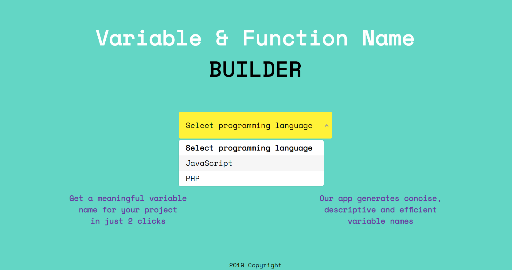
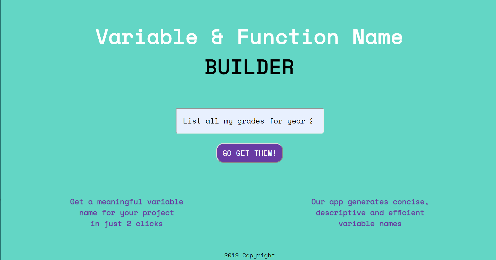
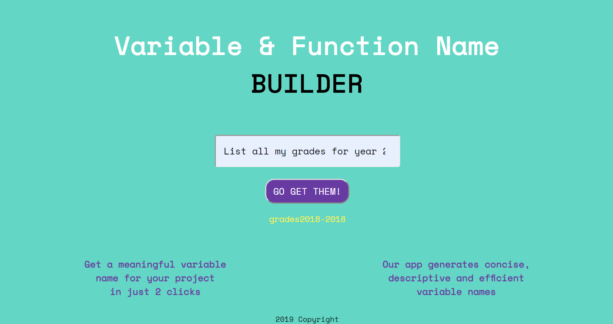

# Variable & Funtion Name BUILDER

A Group project for Shark Hack Hackathon

## Team Members:

Alexandra Kollarova
Shraddha Kharche
Sonali Ganatra
Brian Vannah

## Link:

[Variable & Funtion Name BUILDER](https://alexandrakollarova.github.io/Variable-Name-Builder/)

## Description:

This app allows you to generate descriptive variable and function names for your project.

## In action:

### Step 1

### Choose your programming language

### Step 2

### Describe what you're looking for

### Get Results

## Tech Used:

- JavaScript
- jQuery
- HTML
- CSS
- Python

## Progress

The project is still in progress. Working on machine learning part..
